# 曜灵--网络空间测绘平台

可对全球暴露在互联网上的设备和域名进行：ip主机探测、端口识别、协议解析、web指纹识别、各种信息收集。通过网络空间测绘技术，将地理空间、社会空间、网络空间相互映射，将虚拟的网络空间绘制成一幅动态、有效的网络空间地图，实现互联网资产的可查、可定位，帮助解决互联资产暴露面梳理的难题。


## 作品介绍

### 用户价值

1. 暴露面梳理服务

   互联网未知资产发现服务帮助用户解决因内部管理流程不完善等原因导致未知资产暴露在外，存在被非法人员渗透利用的风险

2. 漏洞感知服务

   在漏洞发布后，第一时间帮助监管部门掌握该风险应用在其管辖范围内的影响范围、影响目标，助力监管部门推动管辖对象对风险的整改。

3. 域名画像

   更直观的获取域名相关信息，对未备案的域名进行分析。帮助监管部门更好的规范网络安全。

### 作品功能

1. 互联网暴露资产搜索

   对暴露在互联网的资产提供搜索功能,用户输入特定的语法,例如"port:6379" 即可检索收录在数据库中开放6379端口的主机。这里输入 && 获取全部数据

   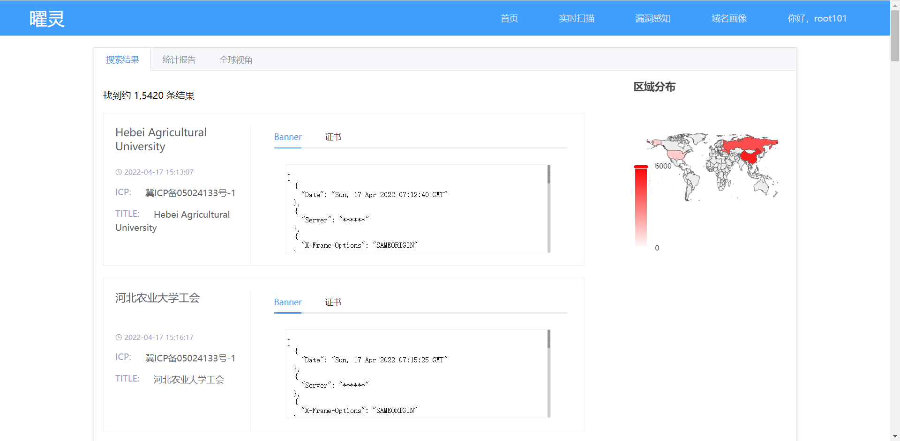

   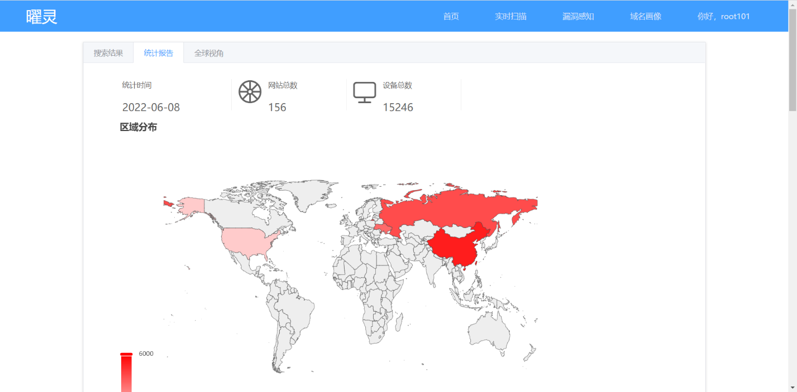

2. 生成域名画像

   通过对各地数百个dns服务器进行查询，全面的获取域名的dns解析记录,综合http响应ip地理位置对域名进行CDN判断，并结合icp、whois信息、对应子域名等信息对域名基础属性和域名谱系关系进行测绘

   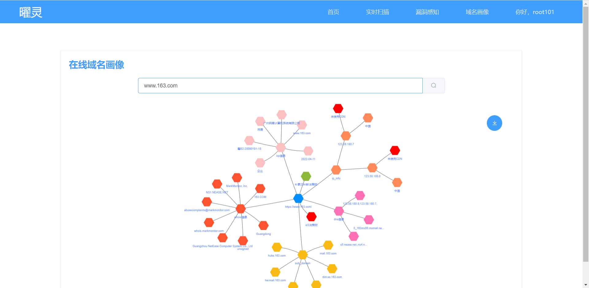

3. 漏洞感知

   使用知道创宇开源的pocsuit3框架进行漏洞验证,自己编写以及收录了符合框架的公开poc,poc类别包括device、server、CMS、web框架、os等等
   device:例如Hikvision历史漏洞
   CMS:针对dede、discuz等web框架的poc
   web框架:针对structs2、spring、drupal、thinkphp等web框架的poc
   os:针对某种操作系统独有的漏洞例如CVE-2020-0796针对windows smb服务的poc
   中间件:针对weblogic、zookeeper等组件的poc

   漏洞验证过程:

   在1960个开启http服务且使用的是java语言的ip进行structs2漏洞验证共有40个ip存在漏洞

   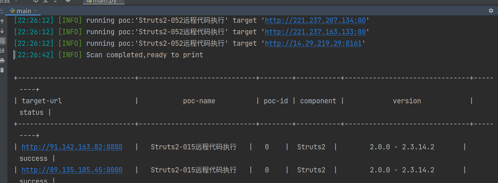

   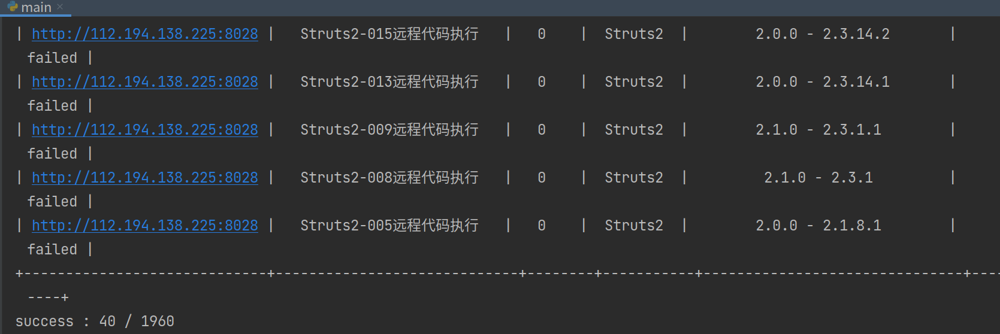

4. 在线扫描功能

   对于未收录在数据库中的ip或域名，提供给用户在线扫描的功能，在线的查看暴露的资产。

   

5. 局域网管理

   对扫描端部署的局域网进行更全面的局域网探测，帮助管理员更好的维护局域网安全。

   

6. 重点资产关注

   对关注的资产进行漏洞关联查看同样满足漏洞的其他ip，C端查看、同主域名ip关联等等

### 作品特色

1. 项目容器化

   - 项目各处采用容器化，使得项目及其容易部署且跨平台，配置环境的时间大大减少。
   - 项目各部分的容器化使得项目可以自由组合自由扩展，方便后期延续。

2. 插件式编程

   ​		插件是把模块加载到系统中，运行它，增强当前系统功能，或者提供系统不具备的功能，往往插件技术应用在框架设计中，系统本身设计简单化，轻量级，实现基本功能后，其他功能通过插件加入进来，方便扩展。扫描端引用了插件化开发的模式，之后扩展扫描端的时候只需要将符合格式的py文件放入扫描端对应位置，无需修改源代码即可完成扩展。

3. go ants进行探测加速

   ​		在进行开放端口探测的时候使用python会花费很长的时间，所以这里使用golang对项目进行提速,因为需要使用goroutine进行并发所以这里用到了go的goroutine池ants。
   ​		ants是一个高性能的goroutine池，实现了对大规模 goroutine 的调度管理、goroutine 复用，允许使用者在开发并发程序的时候限制goroutine数量，复用资源，达到更高效执行任务的效果。

4. 域名画像

   对域名基础属性和域名谱系关系进行测绘，在测绘过程中使用了ID3决策树对未备案的域名进行判断，使用了朴素贝叶斯决策树对CDN进行了判断。

5. 多源web指纹融合

   多个指纹库和工具进行了整理，对指纹库进行了去重，并对每个指纹进行了命中率的标识，从而在使用指纹时会从优先使用命中率高的指纹进行匹配。该部分也加入了开源的tidefinger工具，使得在指纹识别方面更加快捷、简单。


### 作品实现原理

vue与java实现前后端分离 ，vue部分为web前端、java部分负责web服务

redis用做缓存服务器、redis中的redis stream功能用来做消息队列

扫描端主体由python实现部分流程使用了golang，这里多进程+多线程实现高并发信息收集

elasticsearch用于做搜索引擎将扫描端的获取的数据存入elasticsearch中

mysql存储关系型数据，poc与ip的关系，扫描记录，用户信息等等


本项目vue与java只是负责前端展示和web服务，此处流程忽略。

#### 扫描端

原理如下图所示:

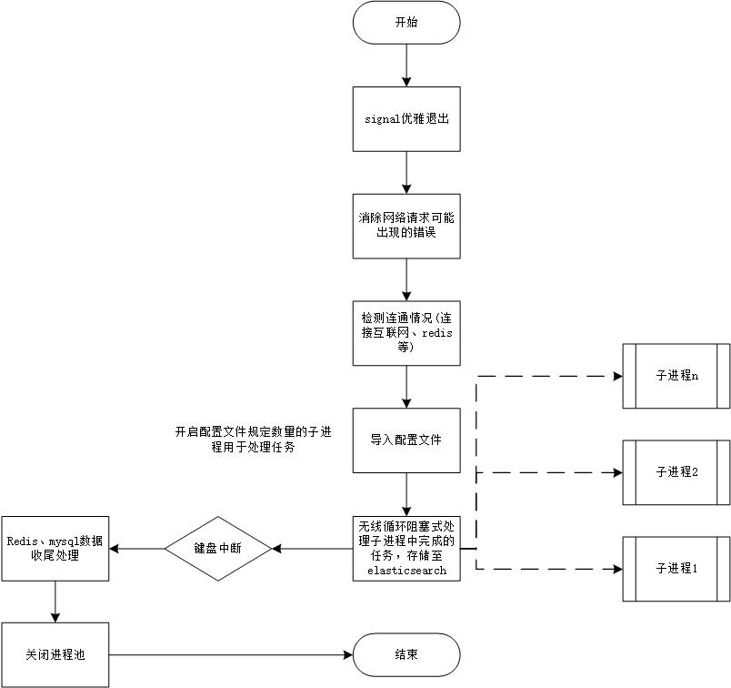

扫描端通过python的multiprocess模块开启多进程解决GIL的限制，实现在多核操作系统上的并行,这里每个子进程都负责接收任务并扫描。

下图为每个子进程对应的流程

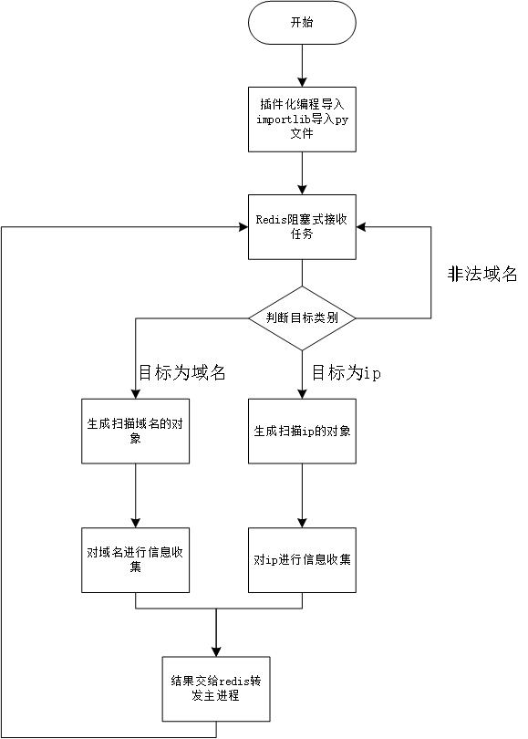

每个子进程初始化完成后的第一个流程就是使用python的importlib模块动态导入py文件，实现增加功能无需修改源代码的插件化编程，同时导入的文件后面的流程循环使用，进入循环后有一个redis连接对象来进行阻塞式接收持续不断的从redis stream消息队列中获取任务，对获取的任务进行扫描分类分为扫描ip和扫描域名。

如下图所示，子进程中如果遇到重IO操作的流程则会在子进程中开启多线程，遇到重CPU操作的流程则会顺序执行

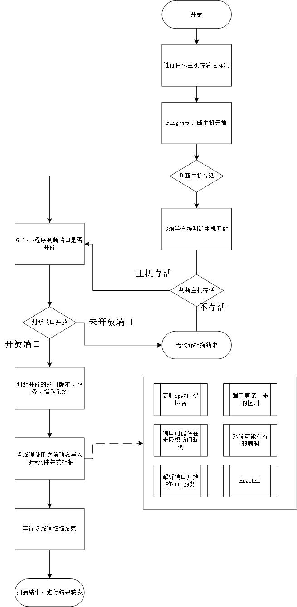


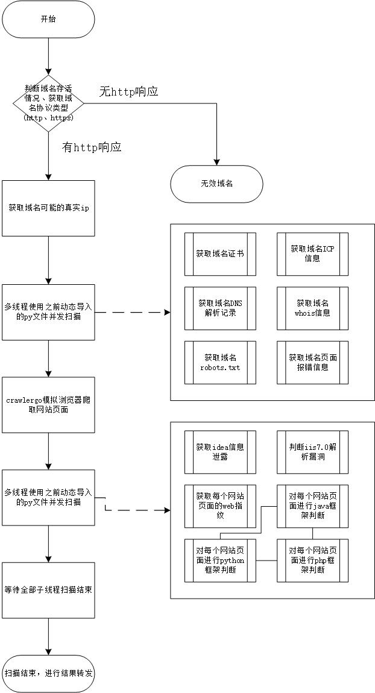


#### 域名画像实现

将域名抽象成基础属性、谱系关系、时空轨迹等一系列相关属性的方法，是采用多维属性信息描述域名的模型。

- 域名基础属性

  域名基础属性是刻画和描述域名某一时刻静态特征的集合，包括域名对应IP地址、域名拥有者、注册时间、到期时间、对应证书、证书加密方式、状态信息、邮箱信息、更新时间、注册链接等相关属性信息。

- 域名谱系关系

  例如baidu.com，google.com；三级域名是在二级域名的基础上添加一些字符，用于对二级域名进行扩展的域名，例如map.baidu.com。域名的同源特征是指两个或多个域名具有共同的祖先域名节点。域名的解析路径是指DNS在实现域名与IP相互映射关系时先后请求的所有服务器及IP地址，将服务器、IP被请求顺序记录下来就得到该域名的解析路径。

对域名基础属性和域名谱系关系进行测绘，在测绘过程中使用了ID3决策树对未备案的域名进行判断，使用了朴素贝叶斯决策树对CDN进行了判断。


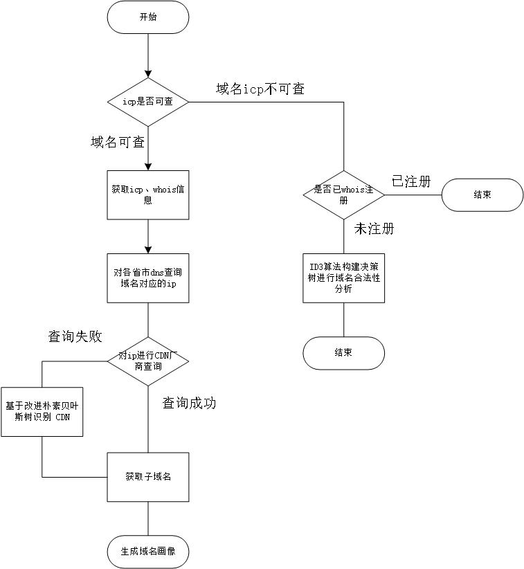


## 用户手册

### 安装手册

本平台占用资源过多不适合组件全部安装到一台主机上

前端、web服务、elasticsearch、redis、mysql 需要的系统环境:具有docker的windows、linux环境均可

扫描端:安装docker的debian系列linux系统、windows系统 (均需要桥接模式)

域名画像:python3环境、linux、windows系统均可 开放50001端口


保证流畅的基础配置:

建议将elasticsearch(默认占1G内存)单独部署到一台主机上(最低2核2G)，有条件可部署成集群

redis(2核、2G)

mysql(1核、512MB)

扫描端(默认扫描端开启子进程个数为主机内核数量,扫描端最低内存512MB)，有条件可部署成集群，共同处理扫描任务

域名画像(内核不限,最低内存512MB)

web服务端(2核、2G)

vue前端(2核、2G)

#### 安装elasticsearch

docker部署单节点elasticsearch容器

```shell
docker run -d --name my-elasticsearch  -p 9200:9200 -p 9300:9300 -e "discovery.type=single-node" elasticsearch:7.6.1
```

#### 安装redis

```shell
docker run --name my-redis -d -p 6379:6379  redis-server --save 60 1 --loglevel warning redis:6.2
```

#### 安装mysql

```shell
docker run --name my-mysql -d -p 3306:3306  -e MYSQL_ROOT_PASSWORD=设置你的mysqlroot用户密码  mysql:5.7.6
```

#### 安装扫描端

```shell
docker run -itd cuitscan/cuitscan:1.2.1
docker exec -it 容器名 bash
=========================下面是进入容器后输入的命令
vim scan_setting.py 
# 进行文件配置 配置对应的数据库的ip、端口和连接密码
python3 scan.py # 开始资产搜集
```

#### 安装域名域名画像

```shell
pip3 install -r requirements.txt  -i https://mirrors.aliyun.com/pypi/simple/
python3 main.py
# 运行后会监听本机的50001端口
```

#### 前端

```
docker run -d -p 8022:8022 treenewking/zps-vue:v1
```

#### web服务端

```bash
docker run -d -p 8022:8022 treenewking/zps-front:v1
# 8022:8022 后者是docker容器中开放的端口前者是映射到主机的端口
```


### 使用说明

三个前台界面 主界面搜索语法、在线扫描的输入内容、域名画像的生成


#### 主界面的那个搜索语法

来个主页截图然后把语法列出下面几个说一下

```
ip="114.116.11.72"  搜索ip为114.116.11.72的ip
ip="114.116.11.72/24"  搜索ip起始为114.116.11的ip
port="6379"  搜索开放端口为6379的ip
server="ftp"  搜索 开启ftp服务的ip信息
country="CN" 或 country="中国" 搜索对应位置为中国的ip
city="成都"   搜索对应城市为成都的ip
os="ubuntu"   搜索对应操作系统为ubuntu的ip

domain="www.163.com"  搜索域名为www.163.com的网站
domain.suffix="163.com" 搜索主域为163.com的网站
status_code="200"  搜索http响应码为200的资产
title="*登录*"  搜索http服务title中包含的登录的服务

icp.owner="xxxx"  搜索拥有者为xxx的域名
icp.companyname:"xxxx"搜索公司名为xxxx的域名
icp.sitelicense:"xxxx"  搜索备案号为xxxx的域名

cert.version="3" 搜索证书版本为3的域名
cert.ST="河北省"  搜索证书所在省份为河北的域名

all_banner="php"  搜索web指纹中包含php的域名
```

#### 在线扫描的输入内容

输入www.163.com、mail.163.com等具体域名

或者输入114.116.11.72、198.157.25.14等具体ip


#### 域名画像生成

输入www.163.com 将会获取dns解析www.163.com的ip地址、获取www.163.com的icp信息、获取的子域名为mail.163.com、game.163.com等与www.163.com同级的域名

如果输入mail.163.com将会获得dns解析www.163.com的ip地址、、获取www.163.com的icp信息、获取的子域名为tl.mail.163.com、m.163.com等比mail.163.com低一级的域名


#### 批量扫描

支持上传txt文件进行批量扫描

也支持114.116.1.1/16这种批量扫

114.116.11.1/24,194.116.11.1/24当然也支持

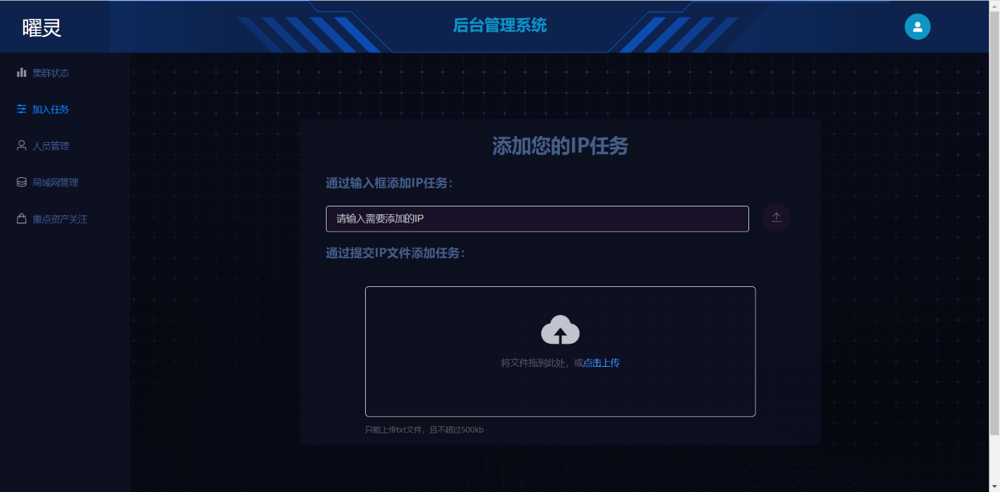


